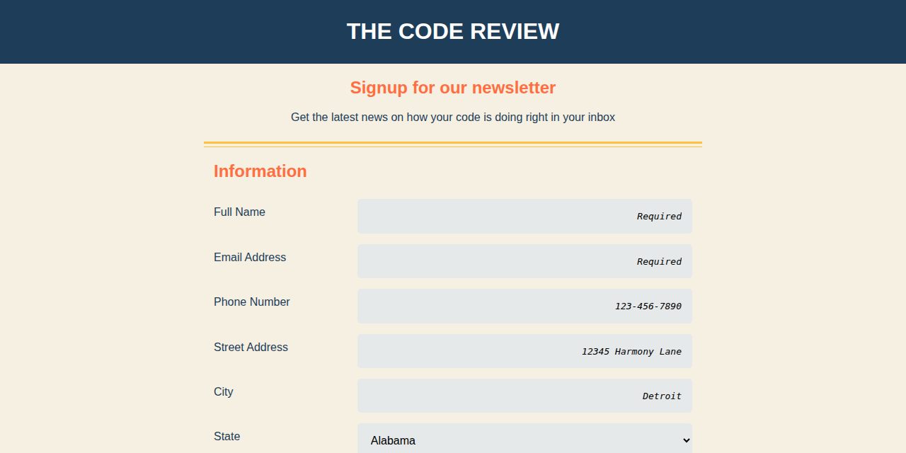

# The Code Review - Newsletter Signup Form

A professionally-designed, responsive newsletter signup form demonstrating modern HTML5 and CSS3 techniques for adaptive web layouts.

[](https://brianwalkerdev.github.io/responsive-web-page-advanced-layouts/)
[](https://opensource.org/licenses/MIT)



## 🚀 Live Demo

**[View Live Demo →](https://brianwalkerdev.github.io/responsive-web-page-advanced-layouts/)**

## ✨ Features

- **Fully Responsive Design** - Seamless experience from mobile to desktop with CSS media queries
- **Accessibility Optimized** - WCAG-compliant with proper ARIA labels and keyboard navigation
- **Modern UI/UX** - Clean design with smooth transitions and interactive states
- **Form Validation** - HTML5 validation for required fields and input patterns
- **Semantic HTML5** - Proper document structure and meaningful markup
- **Mobile-First CSS** - Progressive enhancement from mobile to desktop layouts

## 🛠️ Tech Stack

- **HTML5** - Semantic markup and form structure
- **CSS3** - Flexbox layouts, transitions, and responsive design
- **Normalize.css** - Cross-browser consistency
- **Google Fonts** - Work Sans typography

## 📦 Installation & Usage

### Quick Start

```bash
# Clone the repository
git clone https://github.com/brianwalkerdev/responsive-web-page-advanced-layouts.git
cd responsive-web-page-advanced-layouts

# Open in browser
open index.html
```

### Local Development Server

```bash
# Using Python
python -m http.server 8080

# Using Node.js
npx http-server -p 8080

# Then visit http://localhost:8080
```

### Build for Production

```bash
# Install dependencies (optional)
npm install

# Build static files for deployment
npm run build

# Output will be in ./dist/ directory
```

## 🚀 Deployment

This project is a static site and can be deployed to any static hosting platform:

### GitHub Pages
1. Push your code to GitHub
2. Go to repository Settings → Pages
3. Select branch and root folder
4. Your site will be live at `https://yourusername.github.io/repository-name/`

### Netlify
1. Connect your GitHub repository
2. Build command: `npm run build`
3. Publish directory: `dist`

### Vercel
1. Import project from GitHub
2. Build command: `npm run build`
3. Output directory: `dist`

### Other Platforms
Upload the contents of the `dist` folder (after running `npm run build`) to any static hosting service like AWS S3, Azure Static Web Apps, or Cloudflare Pages.

## 📁 Project Structure

```
responsive-web-page-advanced-layouts/
├── index.html          # Main HTML file
├── css/
│   ├── styles.css      # Custom styles and responsive layouts
│   └── normalize.css   # CSS reset
├── package.json        # Project metadata
├── LICENSE             # MIT License
└── README.md          # This file
```

## 🎨 Design Highlights

- **Color Palette**: Navy blue (#1e3d59), coral orange (#ff6e40), warm yellow (#ffc13b)
- **Typography**: Work Sans font family
- **Responsive Breakpoint**: 768px for mobile-to-desktop transition
- **Interactive Elements**: Hover effects, focus indicators, button animations

## 👤 Contact

**Brian Walker** - Front-End Developer

- Portfolio: [brianwalker.dev](https://brianwalker.dev)
- GitHub: [@brianwalkerdev](https://github.com/brianwalkerdev)
- Email: contact@brianwalker.dev

## 📄 License

This project is licensed under the MIT License - see the [LICENSE](LICENSE) file for details.

---

Made with ❤️ by [Brian Walker](https://brianwalker.dev)
